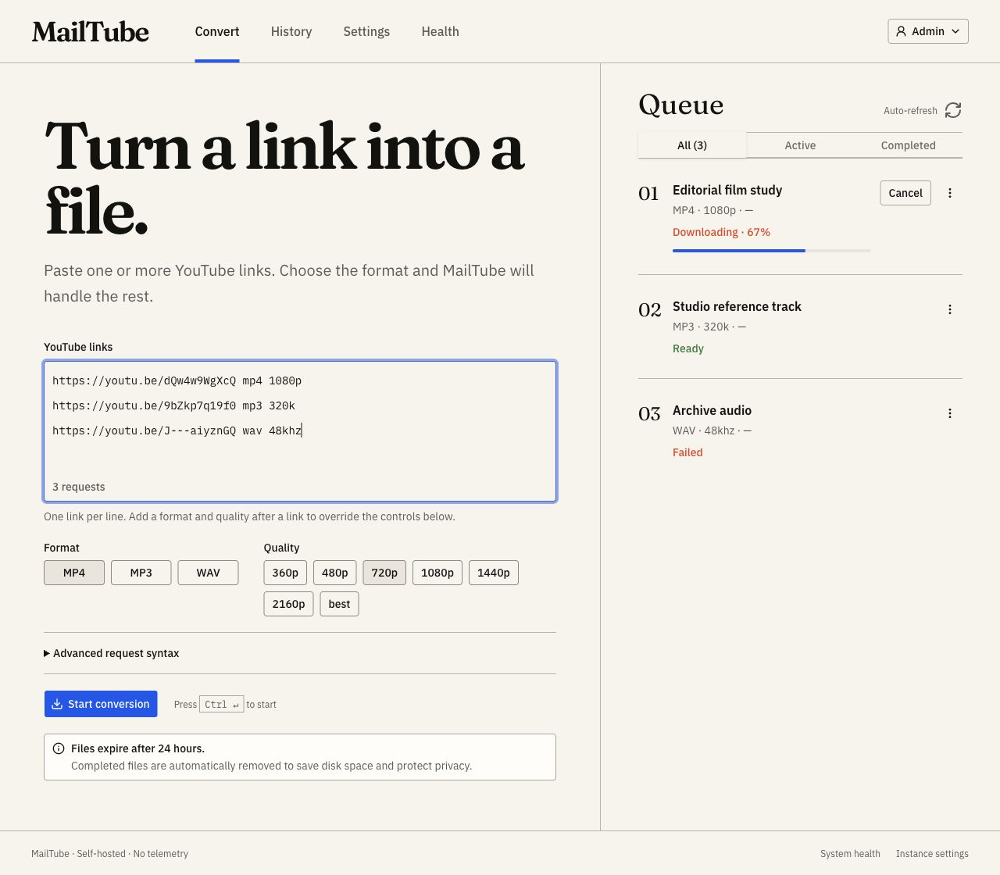

# MailTube

MailTube is a private, self-hosted appliance that turns permitted YouTube links into MP4, MP3, or WAV files. Submit links from its web dashboard or by email; both paths use the same durable, resource-bounded queue.



> [!IMPORTANT]
> Run MailTube on a home or residential network when possible. YouTube commonly restricts VPS, VPN, and datacenter IP addresses. A PO-token provider can improve compatibility with current attestation checks, but it cannot repair poor IP reputation.

## What it includes

- Polished, responsive Next.js dashboard with live queue progress.
- Flexible email syntax: one link and optional format/quality per line.
- MP4 up to 2160p/best, MP3 from 128k–320k, and 16-bit WAV at 44.1/48 kHz.
- Gmail App Password preset plus generic IMAP/SMTP.
- Local downloads or private R2, S3, and MinIO delivery links.
- SQLite persistence, restart recovery, expiry cleanup, cancellation, and bounded concurrency.
- Textual setup wizard designed for SSH and Raspberry Pi OS Lite.
- One application container with no resident Node.js process.
- Multi-architecture `amd64`/`arm64` release design and hardened Compose defaults.

## Quick start

Prerequisites: a 64-bit Linux, macOS, or Windows machine with Docker and Docker Compose v2. Raspberry Pi OS Lite must be 64-bit.

```bash
curl -fsSL https://github.com/cineglobe/MailTube/releases/latest/download/install.sh | sh
```

The installer reopens `/dev/tty` for the interactive wizard, so the piped command remains interactive. To inspect it before running, download `install.sh`, review it, then execute it directly. The release installer pulls the signed multi-architecture image from `ghcr.io/cineglobe/mailtube`. You can also follow [the manual Compose guide](docs/docker-compose.md).

For repeatable unattended deployments, create an owner-only JSON setup file from [the example](docs/setup.example.json), then run:

```bash
chmod 600 setup.json
export MAILTUBE_SETUP_FILE="$PWD/setup.json"
curl -fsSL https://github.com/cineglobe/MailTube/releases/latest/download/install.sh | sh
```

For local development:

```bash
cp .env.example .env
docker compose run --rm mailtube mailtube hash-password
# Set the password hash and a random 32+ character session secret in .env
docker compose up --build
```

Open `http://127.0.0.1:8080`.

<a href="https://www.star-history.com/?repos=cineglobe%2FMailTube&type=date&legend=top-left">
 <picture>
   <source media="(prefers-color-scheme: dark)" srcset="https://api.star-history.com/chart?repos=cineglobe/MailTube&type=date&theme=dark&legend=bottom-right" />
   <source media="(prefers-color-scheme: light)" srcset="https://api.star-history.com/chart?repos=cineglobe/MailTube&type=date&legend=bottom-right" />
   
 </picture>
</a>

## Email requests

Put one request on each line. Lines without format or quality use the configured defaults.

```text
https://youtube.com/watch?v=VIDEO_ID mp4 1080p
https://youtu.be/VIDEO_ID mp3 320k
https://youtube.com/watch?v=VIDEO_ID wav 48khz
https://youtube.com/watch?v=VIDEO_ID
```

| Output | Choices | Default |
|---|---|---|
| MP4 | 360p, 480p, 720p, 1080p, 1440p, 2160p, best | 720p |
| MP3 | 128k, 192k, 256k, 320k | 192k |
| WAV | 44.1 kHz, 48 kHz; 16-bit PCM | 44.1 kHz |

MP4 selects the best available stream at or below the requested height. MP3 bitrate is an encoding target, not an improvement to the source. WAV output can be very large. Playlists are intentionally disabled in v1.

## Recommended deployment

- Use a dedicated Gmail mailbox and dedicated storage credentials.
- Keep the dashboard on localhost, a trusted LAN, or [Tailscale Serve](docs/tailscale.md).
- MailTube never changes Tailscale Serve routes automatically; the installer prints a port-specific command for you to review.
- Keep sender policy on allowlist-only unless you understand the abuse risk.
- Prefer private object storage links for email delivery. Gmail's 25 MB total attachment limit includes MIME overhead, so MailTube uses an 18 MiB safe ceiling.
- Leave the default 24-hour retention in place unless you have a reason to change it.

Start with [installation](docs/installation.md), [Raspberry Pi](docs/raspberry-pi.md), [Gmail](docs/gmail.md), [storage](docs/storage-r2.md), and [configuration](docs/configuration.md).

## Security and privacy

MailTube has one administrator, strict same-origin sessions, CSRF protection, Argon2id password hashes, private artifacts, non-root containers, a read-only root filesystem, and no telemetry. It does not log credentials or presigned URLs. Public unauthenticated exposure is unsupported.

Read [security](docs/security.md), [privacy and retention](docs/privacy-retention.md), and [the security policy](SECURITY.md) before exposing an instance outside your machine.

## Legal notice

MailTube is not affiliated with YouTube or Google. You are responsible for copyright, permissions, local law, and platform terms. Do not use MailTube to bypass DRM, paywalls, or access controls. Only download media you are entitled to download.

## Documentation

- [Architecture](docs/architecture.md)
- [Email syntax](docs/email-syntax.md)
- [Generic email providers](docs/generic-email.md)
- [R2](docs/storage-r2.md), [AWS S3](docs/storage-s3.md), and [MinIO](docs/storage-minio.md)
- [Updates](docs/updates.md), [backup/restore](docs/backup-restore.md), and [yt-dlp troubleshooting](docs/troubleshooting-ytdlp.md)
- [Development](docs/development.md) and [contributing](CONTRIBUTING.md)

Licensed under [GNU AGPL-3.0-only](LICENSE).
