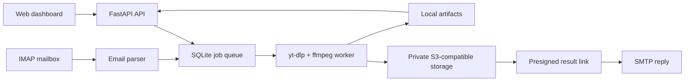

# Architecture

FastAPI serves the statically exported Next.js dashboard and versioned API. A lifespan-managed coordinator polls a WAL-mode SQLite queue and runs a bounded number of yt-dlp/ffmpeg subprocesses. The email poller creates the same batch/job records as the dashboard. Storage adapters retain local files or stream them to private S3-compatible storage.

One Python process, SQLite, and no default Redis/PostgreSQL/Node server keep idle use predictable. Subprocesses stream to disk, use process groups for cancellation, and never interpolate a shell command. See the source modules under `src/mailtube` for API, jobs, downloader, email, storage, setup, and security boundaries.
